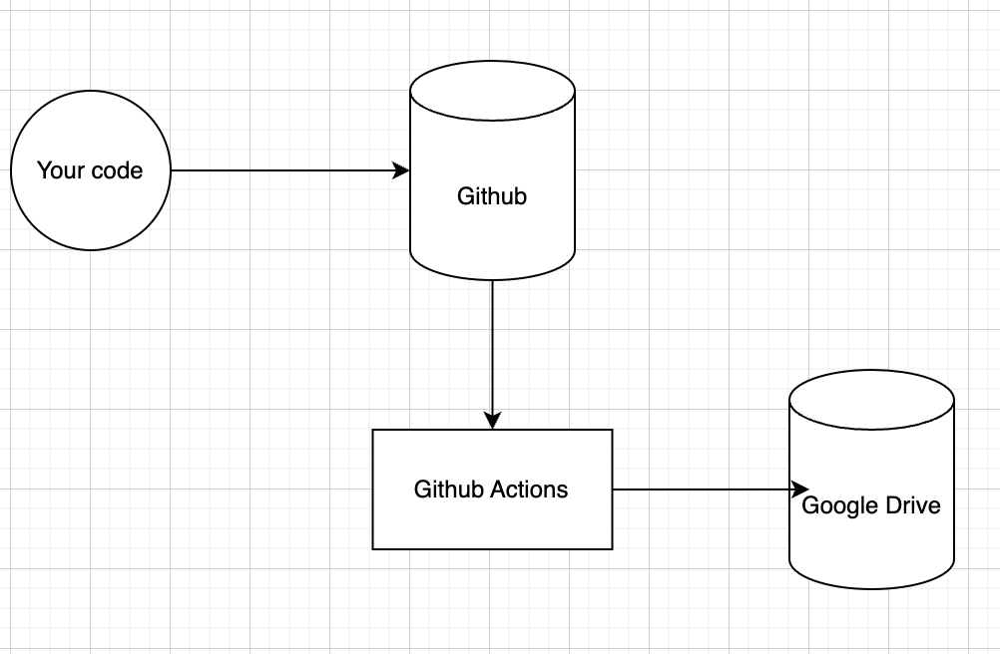

# Analisis Data Airbnb

Airbnb adalah jaringan pasar daring dan penginapan rumahan sejawat yang memungkinkan pengguna mendaftarkan atau menyewa properti untuk digunakan dalam jangka pendek. Harga sewanya ditetapkan oleh pemilik properti. Melalui analisa harga properti Airbnb di Bangkok menjadi wawasan bagi pemilik properti dalam menentukan harga yang kompetitif, memahami kebutuhan pasar, serta merancang strategi yang lebih efektif dalam pengelolaan properti untuk meningkatkan pendapatan penyewaan properti Airbnb di Bangkok

# Pernyataan Masalah
Pemilik properti Ingin **meningkatkan pendapatan dan daya tarik properti Airbnb di Bangkok**. 

Sebagai seorang data scientist, saya akan menjawab pertanyaan berikut:

**Bagaimana meningkatkan pendapatan dan daya tarik properti Airbnb di Bangkok?**

## Analisis yang Diperlukan

- **Analisis Harga Properti Berdasarkan Lokasi**:

Mengidentifikasi lokasi-lokasi dengan harga properti tinggi dan rendah untuk menyesuaikan harga secara cerdas.
- **Harga terhadap tipe kamar**:

Memahami perbedaan harga antar jenis kamar untuk menawarkan diversifikasi yang lebih baik kepada calon penyewa.

- **Jumlah Tipe Kamar berdasarkan daerah**:

Untuk memahami macam tipe kamar yang banyak dibangun pada daerah tertentu

- **Jumlah ulasan pada tipe kamar dan listing**

Mengetahui faktor-faktor yang paling memengaruhi jumlah ulasan untuk meningkatkan popularitas properti.

## Dataset

Data set yang digunakan pada analisis ini berasal dari [Kaggle](https://www.kaggle.com/code/indraputra21/airbnb-data-extraction-and-visualizationhttps:/).

## Data Information


| Nama Kolom                           | Deskripsi                                                                                                                                              |
|--------------------------------------|--------------------------------------------------------------------------------------------------------------------------------------------------------|
| Unnamed: 0                           | Index dari dataset                                                                                                                                     |
| id                                   | Primary key untuk baris tempat tersebut.                                                                                                              |
| name                                 | Nama dari listing.                                                                                                                                     |
| host_id                              | Primary key untuk pemilik/tuan rumah.                                                                                                     |
| host_name                            | Nama tuan rumah/host                                                                                                         |
| neighborhood                         | Nama daerah yang ada di kota Bangkok                                                                             |
| Latitude                             | Garis untuk koordinat lintang.                                                                              |
| Longitude                            | Garis untuk koordinat bujur.                                                                                |
| room_type                            | Tipe ruangan ('Entire home/apt', 'Private room', 'Hotel room', 'Shared room')                                                 |
| price                                | Harga sewa                                                                                                     |
| minimum_nights                       | Jumlah minimum masa sewa permalam.                                                                          |
| number_of_reviews                    | Jumlah ulasan yang dimiliki tempat sewa.                                                                                                                     |
| last_review                          | Tanggal terakhir ulasan.                                                                                                                         |
| reviews_per_month                    | Jumlah rata-rata ulasan setiap bulan.                                                                     |
| calculated_host_listings_count       | Jumlah tempat yang dimiliki pemilik.                                                                  |
| available_365                        | Ketersediaan tempat selama 365 hari ke depan.                                                                                                            |
| number_of_reviews_ltm                | Jumlah ulasan yang dimiliki tempat selama 12 bulan terakhir.                                                                                           |


## Dashboard (Tableau)

Untuk visualisasi menggunakan dashboard dapat dilihat [disini](https://public.tableau.com/app/profile/fadhel.ijlal.falah8801/viz/Capstone_17030639284550/Dashboard?publish=yes).

## Story (Tableau)

Untuk visualisasi menggunakan Story dapat dilihat [disini](https://public.tableau.com/views/Capstone_17030639284550/Story?:language=en-US&publish=yes&:display_count=n&:origin=viz_share_link).

## Cleaned Data



Dengan *Github Actions* setiap ada perubahan *code* pada *repository* ini akan otomatis diunggah ke [Google Drive](https://drive.google.com/drive/u/0/folders/1tkawfK96-JxqLFGSjdZUMnlCl5x06FHh) yang merupakan hasil dari data cleaning.

## How to run project

### Clone project

Agar project ini dapat berada di computer kalian, kalian perlu mengclone project ini dengan perintah berikut.

```
git clone git@github.com:fadhelmurphy/airbnb-analysis.git

cd airbnb-analysis
```

### Install

Sebelum menjalankan project kita perlu melakukan instalasi *package* agar notebook dapat dijalankan dengan baik.

```
pip install -r requirements.txt
// or
pip3 install -r requirements.txt
```

### Run

Jika kalian menggunakan vscode dapat langsung membuka file ipynb tersebut.

jika kalian menggunakan jupyter kalian dapat menjalankan perintah berikut.

`jupyter notebook.ipynb`
